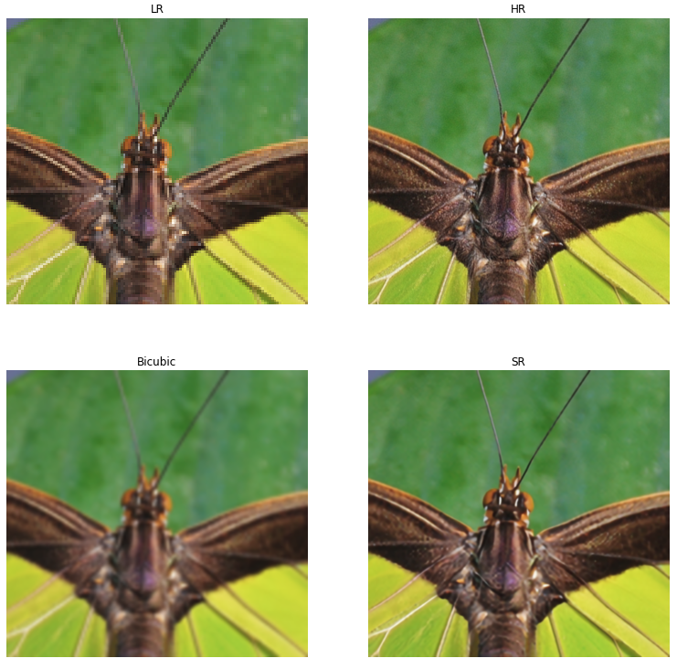
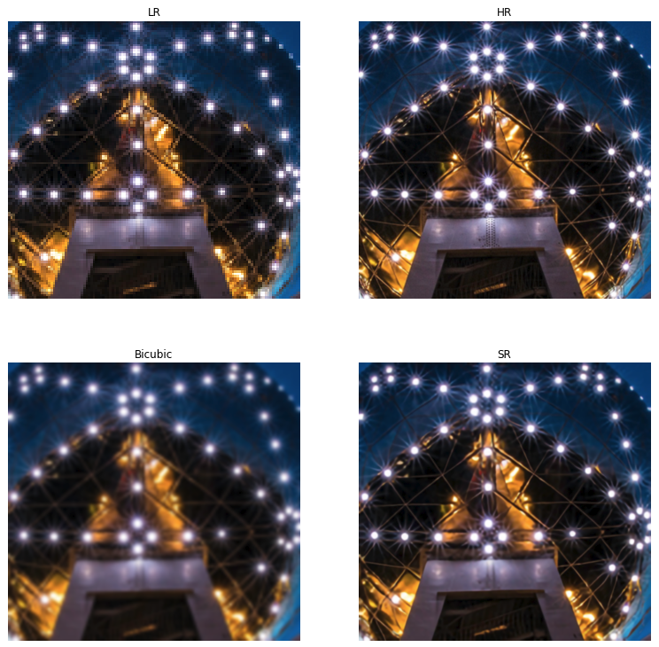
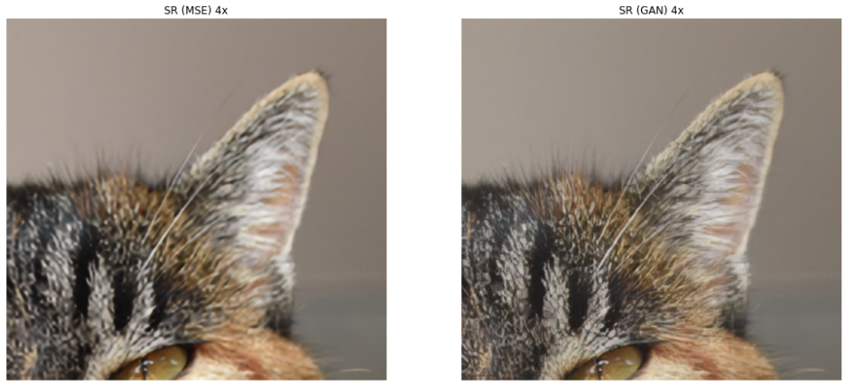

# Single Image Super-Resolution with WDSR, EDSR and SRGAN

A [Keras](https://keras.io/)-based implementation of

- [Wide Activation for Efficient and Accurate Image Super-Resolution](https://arxiv.org/abs/1808.08718) (WDSR), winner 
  of the [NTIRE 2018](http://www.vision.ee.ethz.ch/ntire18/) super-resolution challenge.
- [Enhanced Deep Residual Networks for Single Image Super-Resolution](https://arxiv.org/abs/1707.02921) (EDSR), winner 
  of the [NTIRE 2017](http://www.vision.ee.ethz.ch/ntire17/) super-resolution challenge.
- [Photo-Realistic Single Image Super-Resolution Using a Generative Adversarial Network](https://arxiv.org/abs/1609.04802) (SRGAN).

This projects also supports fine-tuning of EDSR models as generators in SRGAN-like networks.

## Table of contents

- [Environment setup](#environment-setup)
- [Getting started](#getting-started)
- [Dataset](#dataset)
- [Training](#training)
- [Evaluation](#evaluation)
- [Pre-trained models](#pre-trained-models)
- [JPEG compression](#jpeg-compression)
- [Weight normalization](#weight-normalization)
- [Other implementations](#other-implementations)
- [Limitations](#limitations)

## Environment setup

On a system with a GPU create a new [conda](https://conda.io) environment with *)

    conda env create -f environment-gpu.yml
    
On a system without a GPU create an environment with

    conda env create -f environment-cpu.yml

Activate the environment with

    source activate sisr
    
<small>*) It is assumed that appropriate [CUDA](https://developer.nvidia.com/cuda-toolkit) and 
[cuDNN](https://developer.nvidia.com/cudnn) versions for the current [tensorflow-gpu](https://www.tensorflow.org/install/gpu) 
version are already installed on your system. These libraries are not automatically installed when using `environment-gpu.yml`.
</small>

## Getting started

This section uses [pre-trained models](#pre-trained-models) to super-resolve images with factor x4. 

### WDSR

Here, the pre-trained WDSR-A model [wdsr-a-32-x4](https://drive.google.com/open?id=1ZTIz1YVXFTI2z3rvBfVuBSthJLJZivxC) is
used. Click on the link to download the model. It is an experimental model not described in the WDSR paper that was 
trained with a pixel-wise loss function (mean absolute error). Assuming that the path to the downloaded model is 
`~/Downloads/wdsr-a-32-x4-psnr-29.1736.h5`, the following command super-resolves images in directory [`./demo`](demo) 
with factor x4 and writes the results to directory `./output`:

    python demo.py -i ./demo -o ./output --model ~/Downloads/wdsr-a-32-x4-psnr-29.1736.h5
    
The `output` directory only contains the super-resolved images. Below are figures that additionally compare the 
super-resolution (SR) results with the corresponding low-resolution (LR) and high-resolution (HR) images and an x4 
resize with bicubic interpolation (code for generating these figures not included yet).  

### EDSR + SRGAN

A problem with pixel-wise loss functions is that they fail to recover high-frequency details. Super-resolution results
are typically overly smooth with lower perceptual quality, especially at scale x4. A perceptual loss as described in the 
SRGAN paper (a combination of a VGG-based content loss and an adversarial loss) is able to generate more realistic 
textures with higher perceptual quality but at the cost of lower PSNR values.

An EDSR baseline model that has been fine-tuned as generator in an SRGAN-like network can be downloaded from [here](https://drive.google.com/open?id=1Z7PhioyvTzLBOdrg6c4RNEP9JEIqudwP). 
Please note that support for [SRGAN training](#perceptual-loss-srgan) is still work in progress. Assuming that the path 
to the downloaded model is `~/Downloads/edsr-16-x4-gen-epoch-088.h5`, the following command super-resolves the image in 
directory [`./demo/gan`](demo/gan) with factor x4 and writes the result to directory `./output`:

    python demo.py -i ./demo/gan -o ./output --model ~/Downloads/edsr-16-x4-gen-epoch-088.h5

The `output` directory only contains the super-resolved image. The following figure additionally compares the result 
with that obtained from an EDSR model that has been trained with a pixel-wise loss only (mean squared error). One can 
clearly see how training with a perceptual loss in a GAN improves recovery of high-frequency content.

## Dataset

If you want to [train](#training) and [evaluate](#evaluation) models, you need to download the [DIV2K dataset](https://data.vision.ee.ethz.ch/cvl/DIV2K/) 
and extract the downloaded archives to a directory of your choice (`DIV2K` in the following example). The resulting 
directory structure should look like:
  
    DIV2K
      DIV2K_train_HR
      DIV2K_train_LR_bicubic
        X2
        X3
        X4
      DIV2K_train_LR_unknown
        X2
        X3
        X4
      DIV2K_valid_HR
      DIV2K_valid_LR_bicubic
        ...
      DIV2K_valid_LR_unknown
        ...
          
You only need to download DIV2K archives for those downgrade operators (unknown, bicubic) and super-resolution scales
(x2, x3, x4) that you'll actually use for training. 

Before the DIV2K images can be used they must be converted to numpy arrays and stored in a separate location. Conversion 
to numpy arrays dramatically reduces image pre-processing times. Conversion can be done with the `convert.py` script: 

    python convert.py -i ./DIV2K -o ./DIV2K_BIN numpy

In this example, converted images are written to the `DIV2K_BIN` directory. By default, training and evaluation scripts 
read from this directory which can be overriden with the `--dataset` command line option. 

## Training

### Pixel-wise loss

WDSR, EDSR and SRResNet *) models can be trained with a pixel-wise loss function with [`train.py`](train.py).
Default for WDSR and EDSR is *mean absolute error*, for SRResNet it is *mean squared error*. For example, a WDSR-A 
baseline model with 8 residual blocks can be trained for scale x2 with

    python train.py --dataset ./DIV2K_BIN --outdir ./output --profile wdsr-a-8 --scale 2
    
The `--dataset` option sets the location of the DIV2K dataset and the `--output` option the output directory (defaults
to `./output`). Each training run creates a timestamped sub-directory in the specified output directory which contains 
saved models, all command line options (default and user-defined) in an `args.txt` file as well as 
[TensorBoard](https://www.tensorflow.org/guide/summaries_and_tensorboard) logs. The super-resolution factor is set with 
the `--scale` option. The downgrade operator can be set with the `--downgrade` option. It defaults to `bicubic` and can
be changed to `unknown`, `bicubic_jpeg_75` or `bicubic_jpeg_90` (see also section [JPEG compression](#jpeg-compression)).

By default, the model is validated against randomly cropped images from the DIV2K validation set. If you'd rather
want to evaluate the model against full-sized DIV2K validation images after each epoch you need to set the `--benchmark` 
command line option. This however slows down training significantly and makes only sense for smaller models. Alternatively, 
you can evaluate saved models later with `evaluate.py` as described in the section [Evaluation](#evaluation). 

To train models for higher scales (x3 or x4) it is possible to re-use the weights of models pre-trained for a smaller 
scale (x2). This can be done with the `--pretrained-model` option. For example,

    python train.py --dataset ./DIV2K_BIN --outdir ./output --profile wdsr-a-8 --scale 4 \ 
        --pretrained-model ./output/20181016-063620/models/epoch-294-psnr-34.5394.h5

trains a WDSR-A baseline model with 8 residual blocks for scale x4 re-using the weights of model `epoch-294-psnr-34.5394.h5`, 
a WDSR-A baseline model with the same number of residual blocks trained for scale x2. 

For a more detailed overview of available command line options and profiles take a look at [`train.py`](train.py) or run
`python train.py -h`. Section [Pre-trained models](#pre-trained-models) also shows the training command for each available
pre-trained model.

<small> *) SRResNet is the super-resolution model used in the SRGAN paper.</small>

### Perceptual loss (SRGAN)

Training with a perceptual loss as described in the SRGAN paper requires a model that has been pre-trained with a pixel-wise 
loss. At the moment, only SRResNet and EDSR models at scale x4 are supported for SRGAN training. For example, SRResNet can 
be pre-trained with 

    python train.py --dataset ./DIV2K_BIN --profile sr-resnet
    
An EDSR baseline model that can be used as generator in an SRGAN-like network can be pre-trained with
    
    python train.py --dataset ./DIV2K_BIN --profile edsr-gen --scale 4 --num-res-blocks 16

Selected models from pre-training can then be used as starting point for SRGAN training. For example, 

    python train_gan.py --dataset ./DIV2K_BIN --generator sr-resnet --label-noise 0.0 \
        --pretrained-model <path-to-pretrained-model>

starts SRGAN training as described in the SRGAN paper using a VGG54 content loss and SRResNet as generator whereas

    python train_gan.py --dataset ./DIV2K_BIN --generator edsr-gen --scale 4 --num-res-blocks 16 \
        --pretrained-model <path-to-pretrained-model>

uses an EDSR baseline model with 16 residual blocks as generator. **SRGAN training is still work in progress**.

## Evaluation

An alternative to the `--benchmark` training option is to evaluate saved models with `evaluate.py` and then select the
model with the highest PSNR. For example,

    python evaluate.py --dataset ./DIV2K_BIN -i ./output/20181016-063620/models -o eval.json
    
evaluates all models in directory `./output/20181016-063620/models` and writes the results to `eval.json`. This JSON
file maps model filenames to PSNR values. The `evaluate.py` script also writes the model with the best PSNR to `stdout`
at the end of evaluation:

    Best PSNR = 34.5394 for model ./output/20181016-063620/models/epoch-294-psnr-37.4630.h5 

The higher PSNR value in the model filename must not be confused with the value generated by `evaluate.py`. The PSNR value 
in the filename was generated during training by validating against smaller, randomly cropped images which tends to yield
higher PSNR values.

## Pre-trained models

The following list contains available pre-trained models. They were trained with images 1-800 from the DIV2K training 
set using the specified downgrade operator. Random crops and transformations were made as described in the EDSR paper. 
Model performance is measured in dB [PSNR](https://en.wikipedia.org/wiki/Peak_signal-to-noise_ratio) on the DIV2K 
validation set (images 801-900, RGB channels, without self-ensemble).

<table>
    <tr>
        <th>Model</th>
        <th>Scale</th>
        <th>Residual blocks</th>
        <th>Downgrade</th>
        <th>Parameters</th>
        <th>PSNR</th>
        <th>Training</th>
    </tr>
    <tr>
        <td><a href="https://drive.google.com/open?id=1oATD-iXlQpcE2mIIEd4-9FOk2Xt5N8oX">edsr-16-x2</a> 1)</td>
        <td>x2</td>
        <td>16</td>
        <td>bicubic</td>
        <td>1.37M</td>
        <td>34.64 dB</td>
        <td>

command
<pre>python train.py --profile edsr-16 \ --scale 2</pre>
</td>        
    </tr>
    <tr>
        <td><a href="https://drive.google.com/open?id=1yzL0sxfT-AjWmjqV0KIKlIceph3oU_ep">edsr-16-x4-gen-pre</a> 2)</td>
        <td>x4</td>
        <td>16</td>
        <td>bicubic</td>
        <td>1.52M</td>
        <td>28.89 dB</td>
        <td>

command
<pre>python train.py --profile edsr-gen \ --scale 4 --num-res-blocks 16</pre>
</td>        
    </tr>
    <tr>
        <td><a href="https://drive.google.com/open?id=1Z7PhioyvTzLBOdrg6c4RNEP9JEIqudwP">edsr-16-x4-gen</a> 3)</td>
        <td>x4</td>
        <td>16</td>
        <td>bicubic</td>
        <td>1.52M</td>
        <td>-</td>
        <td>

command
<pre>python train_gan.py --generator edsr-gen \ --scale 4 --num-res-blocks 16 \ --pretrained-model edsr-16-x4-gen-pre-psnr-28.8885.h5</pre>
</td>        
    </tr>
    <tr>
        <td><a href="https://drive.google.com/open?id=1WmuSpNamFSszQOafrno05o1nDN4QjMeq">wdsr-a-16-x2</a> 4)</td>
        <td>x2</td>
        <td>16</td>
        <td>bicubic</td>
        <td>1.19M</td>
        <td>34.68 dB</td>
        <td>

command
<pre>python train.py --profile wdsr-a-16 \ --scale 2</pre>
</td>        
    </tr>
    <tr>
        <td><a href="https://drive.google.com/open?id=1V4XHMFZo35yB_NTaD0dyw1_plS-78-Ju">wdsr-a-32-x2</a> 5)</td>
        <td>x2</td>
        <td>32</td>
        <td>bicubic</td>
        <td>3.55M</td>
        <td>34.80 dB</td>
        <td>

command
<pre>python train.py --profile wdsr-a-32 \ --scale 2 --res-expansion 6</pre>
</td>        
    </tr>
    <tr>
        <td><a href="https://drive.google.com/open?id=1ZTIz1YVXFTI2z3rvBfVuBSthJLJZivxC">wdsr-a-32-x4</a> 5)</td>
        <td>x4</td>
        <td>32</td>
        <td>bicubic</td>
        <td>3.56M</td>
        <td>29.17 dB</td>
        <td>

command
<pre>python train.py --profile wdsr-a-32 \ --scale 4 --res-expansion 6 \ --pretrained-model wdsr-a-32-x2-psnr-34.8033.h5</pre>
</td>        
    </tr>
    <tr>
        <td><a href="https://drive.google.com/open?id=1_u80R7PA4HauacDw974-hBNfCcnQ9Fah">wdsr-b-32-x2</a> 6)</td>
        <td>x2</td>
        <td>32</td>
        <td>bicubic</td>
        <td>0.59M</td>
        <td>34.63 dB</td>
        <td>

command
<pre>python train.py --profile wdsr-b-32 \ --scale 2</pre>
</td>        
    </tr>
</table>

<small>1) EDSR baseline, see also [EDSR project page](https://github.com/thstkdgus35/EDSR-PyTorch).</small>  
<small>2) EDSR baseline pre-trained for usage as generator in an SRGAN-like network.</small>  
<small>3) EDSR baseline fine-tuned as generator in an SRGAN-like network.</small>  
<small>4) WDSR baseline, see also [WDSR project page](https://github.com/JiahuiYu/wdsr_ntire2018).</small>  
<small>5) Experimental WDSR-A models trained with an expansion ratio of 6 (default is 4).</small>  
<small>6) Experimental WDSR-B model.</small>

## JPEG compression

There is experimental support for adding JPEG compression artifacts to LR images and training with compressed images. 
The following commands convert bicubic downscaled DIV2K training and validation images to JPEG images with quality `90`:

    python convert.py -i ./DIV2K/DIV2K_train_LR_bicubic \
                      -o ./DIV2K/DIV2K_train_LR_bicubic_jpeg_90 \
                       --jpeg-quality 90 jpeg

    python convert.py -i ./DIV2K/DIV2K_valid_LR_bicubic \
                      -o ./DIV2K/DIV2K_valid_LR_bicubic_jpeg_90 \
                       --jpeg-quality 90 jpeg

After having converted these JPEG images to numpy arrays, as described in section [Dataset](#dataset), models can be 
trained with the `--downgrade bicubic_jpeg_90` option to additionally learn to recover from JPEG compression artifacts.
Two models trained in that manner are available as pre-trained models:

<table>
    <tr>
        <th>Model</th>
        <th>Scale</th>
        <th>Residual blocks</th>
        <th>Downgrade</th>
        <th>Parameters</th>
        <th>PSNR</th>
        <th>Training</th>
    </tr>
    <tr>
        <td><a href="https://drive.google.com/open?id=1XatcgjJM1s7BD_nHr8ApnyMhTEozY8SI">wdsr-a-32-x2-q90</a></td>
        <td>x2</td>
        <td>32</td>
        <td>bicubic + JPEG</td>
        <td>3.55M</td>
        <td>32.12 dB</td>
        <td>

command
<pre>python train.py --profile wdsr-a-32 \ --scale 2 --res-expansion 6 \ --downgrade bicubic_jpeg_90 </pre>
</td>        
    </tr>
    <tr>
        <td><a href="https://drive.google.com/open?id=1YBAPemerjTEA2OpQUP2o9iD9BZXdloJQ">wdsr-a-32-x4-q90</a></td>
        <td>x4</td>
        <td>32</td>
        <td>bicubic + JPEG</td>
        <td>3.56M</td>
        <td>27.63 dB</td>
        <td>

command
<pre>python train.py --profile wdsr-a-32 \ --scale 4 --res-expansion 6 \ --downgrade bicubic_jpeg_90 \ --pretrained-model wdsr-a-32-x2-q90-psnr-32.1198.h5</pre>
</td>        
    </tr>
</table>

## Weight normalization

WDSR models are trained with [weight normalization](https://arxiv.org/abs/1602.07868). This branch uses a [modified Adam optimizer](https://github.com/krasserm/super-resolution/blob/master/optimizer/weightnorm.py) 
for that purpose. The meanwhile outdated branch [wip-conv2d-weight-norm](https://github.com/krasserm/super-resolution/tree/wip-conv2d-weight-norm) 
instead uses a specialized [`Conv2DWeightNorm`](https://github.com/krasserm/super-resolution/blob/wip-conv2d-weight-norm/layer.py) 
layer and a default Adam optimizer (experimental work inspired by the official [WDSR Tensorflow](https://github.com/ychfan/tf_estimator_barebone/blob/master/models/wdsr.py) 
port). Current plan is to replace this layer with a default `Conv2D` layer and a [Tensorflow weight normalization wrapper](https://github.com/tensorflow/tensorflow/pull/21276)
when the wrapper becomes officially available.
    
## Other implementations

### WDSR

- [Official PyTorch implementation](https://github.com/JiahuiYu/wdsr_ntire2018) 
- [Official Tensorflow implementation](https://github.com/ychfan/tf_estimator_barebone/blob/master/docs/super_resolution.md) 

### EDSR

- [Official PyTorch implementation](https://github.com/thstkdgus35/EDSR-PyTorch) 
- [Official Torch implementation](https://github.com/LimBee/NTIRE2017)
- [Tensorflow implementation](https://github.com/jmiller656/EDSR-Tensorflow) by [Josh Miller](https://github.com/jmiller656).

## Limitations

Code in this project requires the Keras Tensorflow backend.
