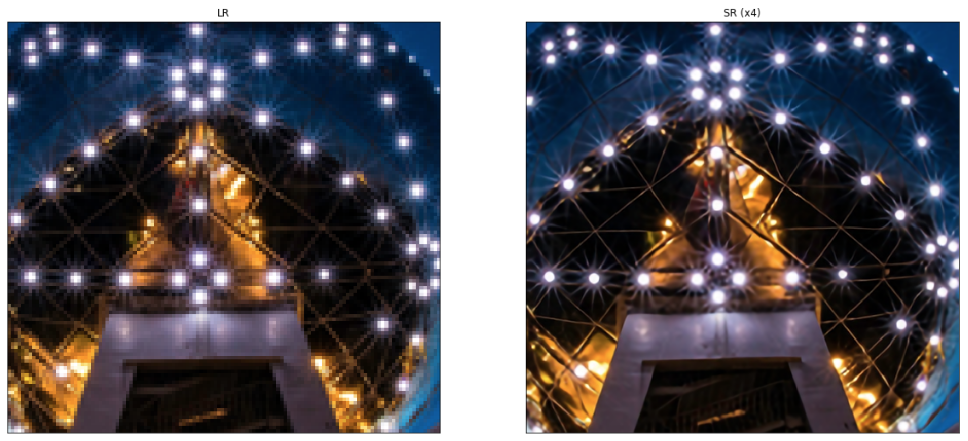
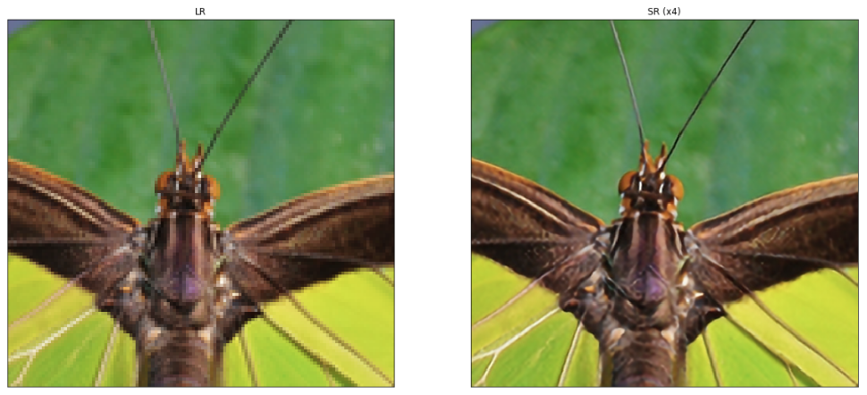
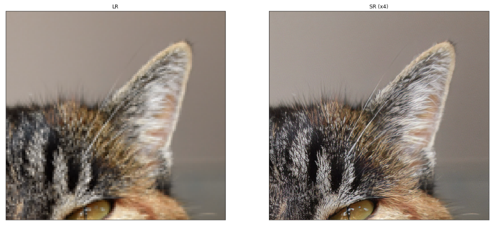

# Single Image Super-Resolution with WDSR, EDSR and SRGAN

A [Tensorflow 2.0](https://www.tensorflow.org/beta) based implementation of

- [Wide Activation for Efficient and Accurate Image Super-Resolution](https://arxiv.org/abs/1808.08718) (WDSR), winner 
  of the [NTIRE 2018](http://www.vision.ee.ethz.ch/ntire18/) super-resolution challenge.
- [Enhanced Deep Residual Networks for Single Image Super-Resolution](https://arxiv.org/abs/1707.02921) (EDSR), winner 
  of the [NTIRE 2017](http://www.vision.ee.ethz.ch/ntire17/) super-resolution challenge.
- [Photo-Realistic Single Image Super-Resolution Using a Generative Adversarial Network](https://arxiv.org/abs/1609.04802) (SRGAN).

A Keras/Tensorflow 1.x based implementation is available [here](https://github.com/krasserm/super-resolution/tree/previous).

## Overview

Training and usage of EDSR, WDSR and SRGAN models is demonstrated in  

- [example-edsr.ipynb](example-edsr.ipynb)
- [example-wdsr.ipynb](example-wdsr.ipynb)
- [example-srgan.ipynb](example-srgan.ipynb) 

A high-level training API and command line interface is **work in progress**. See also the following sections for further
details and [usage examples](#getting-started).

## Environment setup

Create a new [conda](https://conda.io) environment with

    conda env create -f environment.yml
    
and activate it with

    conda activate sisr

## Pretrained weights

The following pretrained weights are available for download:

- [weights-edsr-16-x4.tar.gz](https://drive.google.com/open?id=14RAJsR2h12iNl8-QMMGpoD9aextgbjIj) - EDSR x4 baseline as 
  described in the EDSR paper: 16 residual blocks, 64 filters, 1.52M parameters. PSNR on DIV2K validation set = 28.89 dB.
- [weights-wdsr-b-8-x4.tar.gz](https://drive.google.com/open?id=1GFD0z1o3UXYvRORT486jnwZ9khSkz6Vv) - WDSR B x4 baseline 
  derived from other baselines in the WDSR paper: 8 residual blocks, 32 filters, expansion factor 6, 0.17M parameters 
  (very small model). PSNR on DIV2K validation set = 28.36 dB.
- [weights-srgan.tar.gz](https://drive.google.com/open?id=1u9ituA3ScttN9Vi-UkALmpO0dWQLm8Rv) - SRGAN as described in the 
  SRGAN paper: 1.55M parameters, trained with VGG54 content loss.

After download, extract them in the root folder of the project with

    tar xvfz weights-<...>.tar.gz

## Getting started 

The following examples can also be run in the *Demo* section of the notebooks.

### EDSR

```python
from model import resolve_single
from model.edsr import edsr

from utils import load_image, plot_sample

model = edsr(scale=4, num_res_blocks=16)
model.load_weights('weights/edsr-16-x4/weights.h5')

lr = load_image('demo/0851x4-crop.png')
sr = resolve_single(model, lr)

plot_sample(lr, sr)
```



### WDSR

```python
from model.wdsr import wdsr_b

model = wdsr_b(scale=4, num_res_blocks=8)
model.load_weights('weights/wdsr-b-8-x4/weights.h5')

lr = load_image('demo/0829x4-crop.png')
sr = resolve_single(model, lr)

plot_sample(lr, sr)
```



Weight normalization in WDSR models is implemented with the new `WeightNormalization` layer wrapper of 
[Tensorflow Addons](https://github.com/tensorflow/addons).

### SRGAN

```python
from model.srgan import generator

model = generator()
model.load_weights('weights/srgan/gan_generator.h5')

lr = load_image('demo/0869x4-crop.png')
sr = resolve_single(model, lr)

plot_sample(lr, sr)
```



## DIV2K dataset

For training and validation on [DIV2K](https://data.vision.ee.ethz.ch/cvl/DIV2K/) images, applications should use the 
provided `DIV2K` data loader. It automatically downloads DIV2K images to `.div2k` directory and converts them to binary 
format for faster loading.

### Training dataset

```python
from data import DIV2K

train_loader = DIV2K(scale=4,             # 2, 3, 4 or 8
                     downgrade='bicubic', # 'bicubic', 'unknown', 'mild' or 'difficult' 
                     subset='train')      # Training dataset are images 001 - 800
                     
# Create a tf.data.Dataset          
train_ds = train_loader.dataset(batch_size=16,         # batch size as described in the EDSR and WDSR papers
                                random_transform=True) # random crop, flip, rotate as described in the EDSR paper
```

### Validation dataset

```python
from data import DIV2K

valid_loader = DIV2K(scale=4,             # 2, 3, 4 or 8
                     downgrade='bicubic', # 'bicubic', 'unknown', 'mild' or 'difficult' 
                     subset='valid')      # Validation dataset are images 801 - 900
                     
# Create a tf.data.Dataset          
valid_ds = valid_loader.dataset(batch_size=1,           # use batch size of 1 as DIV2K images have different size
                                random_transform=False, # use DIV2K images in original size 
                                repeat_count=1)         # 1 epoch 
```

## Training 

A command-line interface for model training and evaluation is not implemented yet. See notebooks
 
- [example-edsr.ipynb](example-edsr.ipynb)
- [example-wdsr.ipynb](example-wdsr.ipynb)
- [example-srgan.ipynb](example-srgan.ipynb) 
 
for training details. EDSR and SRGAN training is done with a custom training loop whereas WDSR training uses the 
high-level Keras API.
